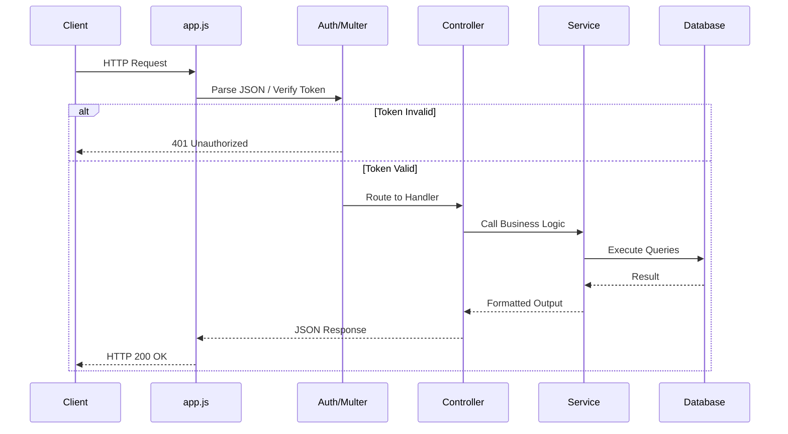
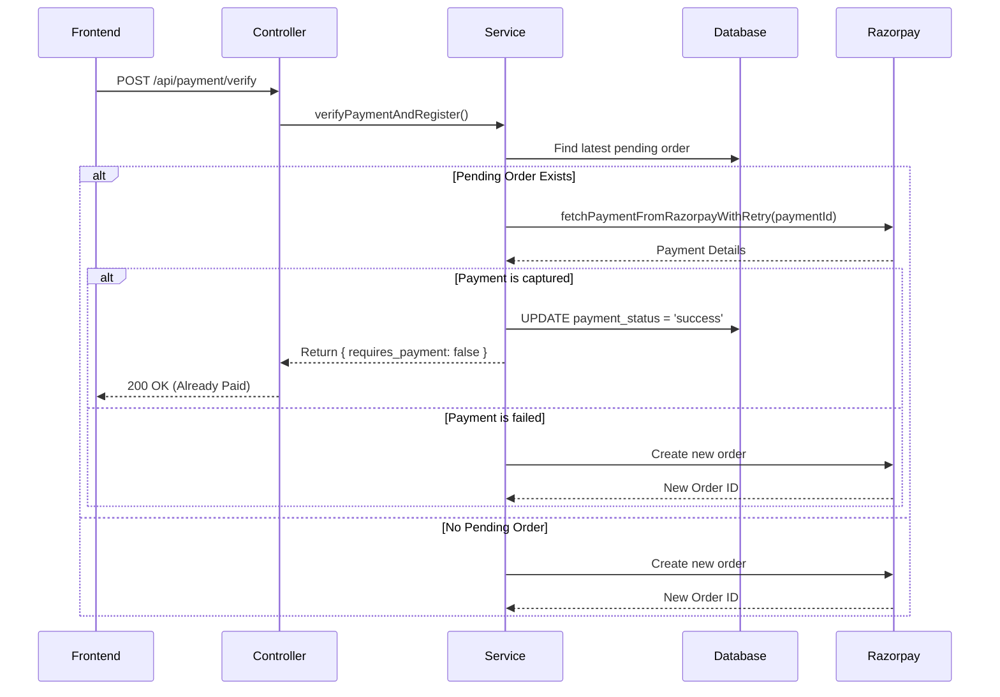
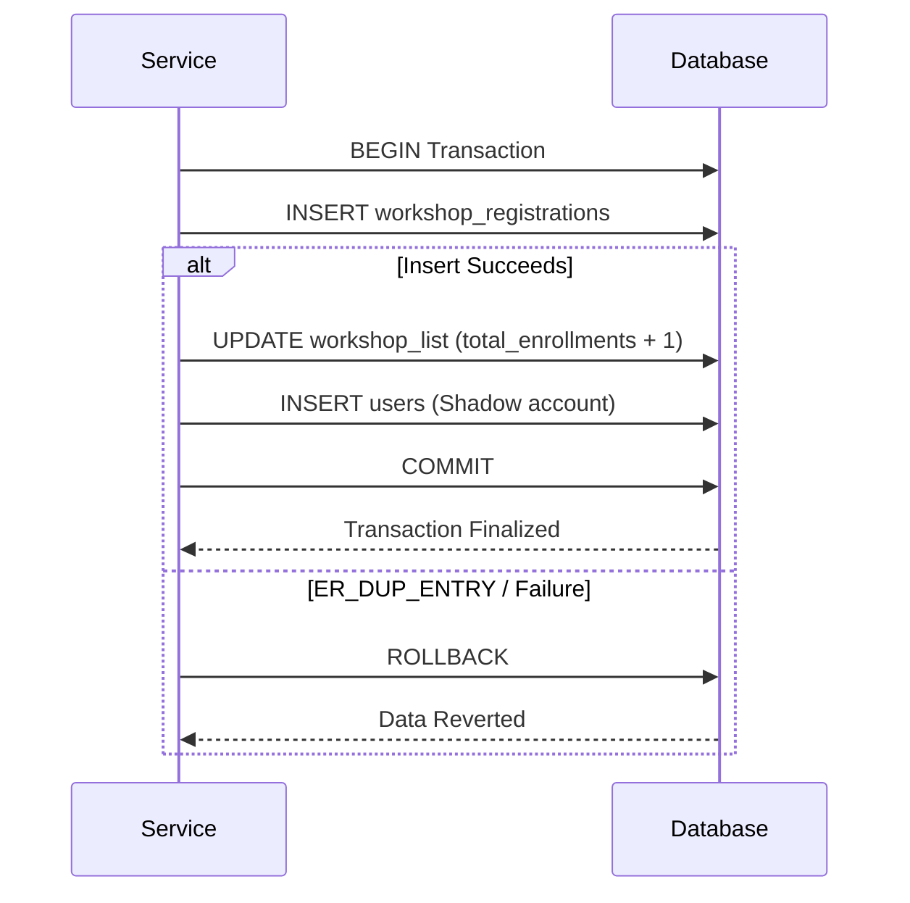
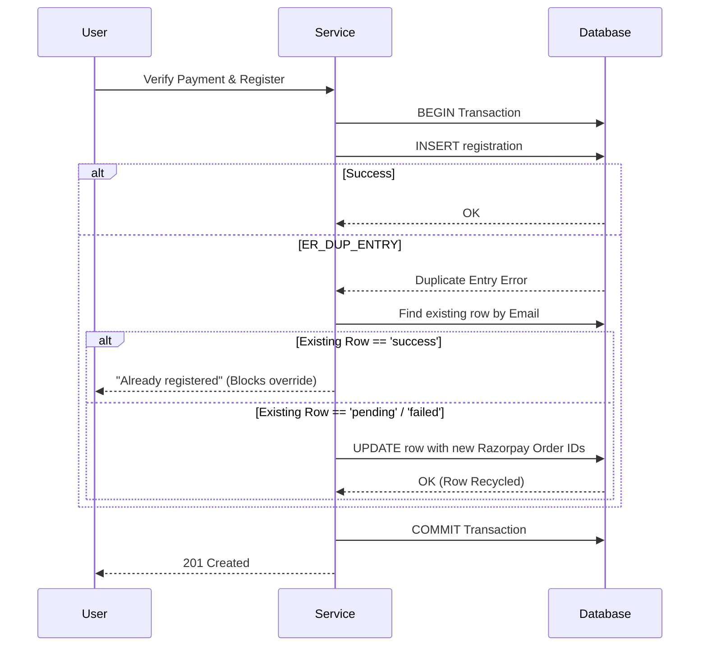

# Code-Aware Backend Execution & Internal Orchestration Documentation

This document provides a meticulously detailed, implementation-aware map of the backend execution flows, internal method orchestration, and data lifecycles. It is designed for senior backend engineers to understand **exactly** which functions execute, how payloads mutate, how transactions are sequenced, and how the system dynamically survives failures and reconciles state.

---

## Table of Contents
1. [Global Request Pipeline & System Orchestration](#1-global-request-pipeline--system-orchestration)
2. [Authentication & Authorization Execution](#2-authentication--authorization-execution)
3. [Payment & Reconciliation Engine (Core Orchestrator)](#3-payment--reconciliation-engine-core-orchestrator)
4. [Workshop Registration Flow Details](#4-workshop-registration-flow-details)
5. [Mentor Registration Dynamic Architecture](#5-mentor-registration-dynamic-architecture)
6. [Internship & Summer School Execution Sequences](#6-internship--summer-school-execution-sequences)
7. [Institutional Registration Pipeline](#7-institutional-registration-pipeline)
8. [Support Ticket Orchestration](#8-support-ticket-orchestration)
9. [User Dashboard Resolution Engine](#9-user-dashboard-resolution-engine)
10. [AWS S3 & File Storage Pipelines](#10-aws-s3--file-storage-pipelines)

---

## 1. Global Request Pipeline & System Orchestration

### 1.1 File-to-File Execution Flow
Every incoming HTTP request traverses a strict middleware gauntlet before hitting business logic.

```text
app.js (Express Application Entry)
→ cors() (Cross-Origin Resolution)
  → express.json({ verify: appendRawBody }) (Payload Parsing & Signature Caching)
    → Route Index (app.use('/api/...', routes))
      → Route Specific File (e.g., workshopRoutes.js)
        → authMiddleware.verifyToken() (JWT Decryption)
          → multer middleware (Local/S3 Multipart Parsing)
            → Controller (Request Extraction)
              → Service (Business Logic / DB Writes)
                → Controller (Response Formatting via res.json)
                  → errorHandler.js (Global catch-all for `next(err)`)
```

### 1.1.1 Visual Diagram (Global Middleware Pipeline)


### 1.2 Data Transformation Flow (Global)
1. **Frontend Payload**: Raw JSON or `multipart/form-data`.
2. **Controller Sanitization**: Trims inputs, normalizes cases (e.g., `email.toLowerCase().trim()`).
3. **Service Context Injection**: Services append derived fields. Example: Calculating minor currency units `Math.round(amount * 100)` before interacting with Razorpay.
4. **DB Payload Generation**: Objects are strictly mapped to parameterized SQL arrays (`[value1, value2]`) to prevent SQL Injection, bypassing ORMs entirely for raw query speed.

---

## 2. Authentication & Authorization Execution

### 2.1 Internal Execution Tree (Login Flow)
```text
authController.login(req, res)
└── authService.login(payload)
    ├── normalizePayload() [email, password extraction]
    ├── DB: SELECT * FROM users WHERE email = ?
    ├── IF !user: throw 401
    ├── IF user.is_active == 0: throw 403 (Account Disabled)
    ├── utils/hashPassword.js -> verifyPassword(plain, hashed)
    │   └── bcrypt.compare()
    ├── DB: UPDATE users SET last_login = CURRENT_TIMESTAMP
    └── utils/jwt.js -> generateToken(user)
        └── jwt.sign({ id, email, role }, SECRET, { expiresIn })
```

### 2.2 Route Protection Flow (RBAC)
When a user accesses an admin endpoint (e.g., `POST /api/workshop-list`), the execution is intercepted:
1. `authMiddleware.verifyToken`: Reads `Authorization: Bearer <token>`. Decodes JWT. Assigns `req.user = decoded`.
2. `roleMiddleware` / `requireRole(['admin'])`: Reads `req.user.role`. If `role !== 'admin'`, terminates the pipeline instantly with `res.status(403)`.

---

## 3. Payment & Reconciliation Engine (Core Orchestrator)

### 3.1 Engineering Reasoning
Webhook delivery from payment gateways (Razorpay) is unreliable. Webhooks drop, timeout, or arrive out-of-order. This backend solves the "Frontend says failed, Gateway says success" race condition by implementing a synchronous polling and reconciliation engine that executes *before* new orders are generated.

### 3.2 Internal Execution Tree (Reconciliation)
```text
verifyPaymentAndRegister() [Service Entry]
├── isValidRazorpaySignature(orderId, paymentId, signature)
│   └── crypto.createHmac('sha256', secret).update().digest()
├── fetchPaymentFromRazorpayWithRetry(client, paymentId)
│   ├── razorpayClient.payments.fetch(paymentId)
│   └── wait(1200ms) [Exponential/Fixed backoff loop - Max 6 Retries]
├── resolvePaymentFromOrderContext(client, orderId, paymentId) [Fallback Lookup]
│   └── razorpayClient.orders.fetchPayments(orderId)
│       └── Iterates over payments to find a 'captured' status
├── validateAmount(payment.amount, expectedAmount)
└── executeTransaction() [DB Upsert overwriting old status]
```

### 3.2.1 Visual Flow Diagram (Reconciliation Engine)


### 3.3 State Transition Flow
`payment_status` lifecycle internally mapped:
- `pending` / `created`: Order generated via `razorpayClient.orders.create`. DB row inserted.
- `authorized` / `captured`: Razorpay confirms payment. Backend verifies signature. The engine maps this state to `success` in local SQL tables.
- `failed` / `cancelled`: Card declined or user abandoned.

### 3.4 Critical Code Snippet: Secure Signature Verification
```javascript
function isValidRazorpaySignature({ orderId, paymentId, signature, keySecret }) {
  // Purpose: Cryptographically prove the payment metadata was not tampered with.
  const digest = crypto
    .createHmac('sha256', keySecret)
    .update(`${orderId}|${paymentId}`)
    .digest('hex');

  const expected = Buffer.from(digest, 'hex');
  const received = Buffer.from(signature.toLowerCase(), 'hex');

  // Uses timingSafeEqual to prevent CPU timing side-channel attacks.
  if (expected.length !== received.length) return false;
  return crypto.timingSafeEqual(expected, received);
}
```

---

## 4. Workshop Registration Flow Details

### 4.1 File-to-File Execution Flow
`workshopRoutes.js` → `workshopRegistrationController.registerWorkshop` → `workshopRegistrationService.verifyPaymentAndRegister(data)` → `razorpayService` (Verification) → DB Transaction Engine → `notificationService` (Async Execution).

### 4.2 Database Write Sequencing & Transaction Boundaries
The entire registration sequence is wrapped in a strict transactional boundary to prevent orphaned payments without enrollments.
**Exact Sequence:**
1. `await connection.beginTransaction()`
2. **Write 1:** `INSERT INTO workshop_registrations ...` (If fails due to bad schema, falls back to legacy columns).
3. **Write 2:** `UPDATE workshop_list SET total_enrollments = COALESCE(total_enrollments, 0) + 1 WHERE id = ?` (Atomic increment prevents race conditions compared to reading count in Node and adding 1).
4. **Write 3:** `INSERT INTO users ...` (If `createWorkshopUserIfMissing` detects no existing account, generates shadow account with hashed phone number).
5. `await connection.commit()`
*Rollback Behavior:* If any query fails (e.g., duplicate unique key constraint `ER_DUP_ENTRY`), `connection.rollback()` is executed, preventing the enrollment counter from incrementing falsely.

### 4.2.1 Visual Execution Diagram (Workshop DB Transaction)


### 4.3 Engineering Reasoning: Fallback Insertion
`insertWorkshopRegistrationRecord` wraps `connection.query` in `try/catch` blocks inspecting `err.code === 'ER_BAD_FIELD_ERROR'`.
**Why?** During live CI/CD deployments, the Node server restarts faster than heavy database migrations execute. This fallback mechanism ensures zero downtime by elegantly falling back to legacy schema structures if new columns (`country`, `payment_currency`) are not yet present in production databases.

---

## 5. Mentor Registration Dynamic Architecture

### 5.1 Payload & Data Transformation Flow
The Mentor payload is massive (40+ properties).
1. **Frontend Payload**: Contains mixed data (strings, objects, files) wrapped in `FormData`.
2. **Controller**: Normalizes missing numeric inputs to `null` to prevent strict SQL constraint errors.
3. **Service Matrix Routing**: Nationality (`Indian` vs `Others`) redirects the payment config to 1000 INR vs 150 USD dynamically.

### 5.2 Internal Execution Tree (Dynamic DB Reflection)
```text
upsertMentorRegistration()
├── DB: SHOW COLUMNS FROM mentor_registrations (via getMentorTableColumns)
├── Filter payload keys against actual DB columns
├── findMentorByEmail()
├── IF completed_payment: Throw Error (Immutable override blocked)
├── IF exists & pending:
│   ├── Generate Dynamic SQL: `UPDATE mentor_registrations SET bio = ?, track = ? ...`
│   └── Execute UPDATE
└── IF missing:
    ├── Generate Dynamic SQL: `INSERT INTO mentor_registrations (bio, track...) VALUES (?, ?...)`
    └── Execute INSERT
```

### 5.3 Engineering Reasoning: Dynamic Schema Adaptation
By using `SHOW COLUMNS` to dynamically construct `INSERT`/`UPDATE` statements (`getMentorWritableColumns`), the backend ensures it never throws a `Column not found` error if the frontend sends a new field before the backend DB migration has completed. It silently drops unknown fields.

---

## 6. Internship & Summer School Execution Sequences

### 6.1 Real Function Orchestration
- `ensureInternshipFeeSettingsSchema()`: Called before every price lookup. Executes `CREATE TABLE IF NOT EXISTS summer_internship_fee_settings` and automatically seeds it with default pricing matrices (General, Lateral, EWS).
- `getApplicableInternshipFeeRupees()`: Analyzes payload booleans (`is_lateral: true`) and strings (`category: 'General'`) to map to the correct dynamic DB column (`lateral_fee_rupees`).

### 6.2 Failure & Fallback Execution Chains (Duplicate Row Reuse)
**Problem:** A user tries to pay, closes the popup, and tries again. An `INSERT` would trigger a Unique Constraint violation (`ER_DUP_ENTRY`) on their email.
**Fallback Chain (`registerInternshipInternal`):**
1. Attempt `INSERT`.
2. Catch `err.code === 'ER_DUP_ENTRY'`.
3. Instead of failing the request, the backend automatically runs `UPDATE summer_internship_registrations SET razorpay_order_id = ? WHERE email = ? AND payment_status != 'success'`.
4. The system transparently repairs the DB state and allows the user to attempt payment again seamlessly.

### 6.3 Visual Execution Diagram (Internship Fallback Flow)



---

## 7. Institutional Registration Pipeline

### 7.1 Database Write Sequencing
1. **Context Lookup**: `findLatestOpenInstitutionalAttempt()` scans for open orders using compound SQL filtering (`email`, `institute_name`, `head_email`).
2. **Upsert Engine** (`upsertInstitutionalAttempt`):
   - Opens DB transaction.
   - If an open attempt is found, executes `UPDATE institutional_registrations`.
   - Replaces `payment_status`, `razorpay_order_id`, and explicitly maps the `failure_reason` if the Razorpay webhook reported a declined card or bank issue.

### 7.2 Data Transformation Flow
- `country` field dictates currency logic.
- `toMoneyInMinorUnits(value)` ensures safe floating-point conversion, dodging JS math errors: `Math.round(numeric * 100)`.
- **Security Check**: A currency mismatch assertion prevents a malicious user from bypassing UI restrictions to pay 500 INR instead of 500 USD: `if (paymentCurrency !== paymentConfig.currency) throw Error`.

---

## 8. Support Ticket Orchestration

### 8.1 File-to-File Flow
`ticketRoutes.js` → `ticketController.js` → `ticketService.js` → (Async) `notificationService.js` (via `nodemailer`).

### 8.2 Internal Execution Tree
```text
ticketController.createTicket()
└── ticketService.createTicket()
    ├── normalizeTicketCategory(payload.category)
    ├── resolveWorkshopTitle(workshopId) [Optional DB Join Context]
    ├── DB: INSERT support_tickets (Retrieves insertId)
    ├── DB: INSERT ticket_messages (Logs initial text as first message)
    └── void notificationService.sendTicketCreatedEmail() [Async Fire-and-Forget]
```

### 8.3 Engineering Reasoning: Async Void Execution
The email trigger explicitly does **not** use `await` at the top level.
**Why?** Web request latency must not be bottlenecked by slow SMTP connection handshakes. By floating the promise (`void`), the user receives a rapid `201 Created` HTTP response while the email dispatch processes entirely in the background Node event loop. If the email fails, a robust `try/catch` inside `notificationService.js` absorbs the error, ensuring the application does not crash.

---

## 9. User Dashboard Resolution Engine

### 9.1 Data Transformation Flow (Inferred Progress)
The Dashboard serves as an aggregator. If a user has paid for a workshop but hasn't started course modules, the backend dynamically infers progress so the UI doesn't look empty.
**Flow (`clampProgress` & mapping):**
1. Read raw DB row from `user_workshop_progress`.
2. If `progress_percent > 0`, trust DB.
3. **Fallback Logic**: If `progress_percent === 0` BUT `payment_status === 'success'`, backend auto-assigns `inferredProgress = 20` (20%).
4. Translates status string (`ongoing`, `completed`, `not-started`) dynamically based on inferred progress numbers.

### 9.2 Fallback Execution Chains (Query Permutations)
The method `fetchUserWorkshopRows` is an engineering marvel for handling incomplete database migrations seamlessly.
**Flow:**
It defines an array of 4 SQL queries:
1. Try fetching with `payment_columns` AND `alternative_email`.
2. Try fetching with `payment_columns` NO `alternative_email`.
3. Try fetching with NO `payment_columns` AND `alternative_email`.
4. Try fetching with NO `payment_columns` NO `alternative_email`.

It loops over these queries sequentially. If `connection.query` throws `ER_BAD_FIELD_ERROR`, it catches it and moves to the next query. This ensures the user dashboard **always loads**, gracefully degrading the data payload if the database schema is outdated.

---

## 10. AWS S3 & File Storage Pipelines

### 10.1 File-to-File Orchestration
`multer` (Memory/Disk Middleware) → `internshipRegistrationController` → `s3StorageService.uploadInternshipPassportPhoto` → `AWS S3 SDK (PutObjectCommand)`.

### 10.2 Internal Function Reference
`buildInternshipPassportPhotoKey(internshipSlug, email, originalFilename)`
- **Purpose**: Generates cryptographically isolated S3 Object Keys.
- **Data Transformation**:
  - `emailSlug = cleanText(email).replace(/[^a-z0-9]/gi, '_')`
  - `randomHex = crypto.randomBytes(4).toString('hex')`
  - `timestamp = Date.now()`
  - **Output Sequence**: `internships/2026/summer-school/user_gmail_com/passport-photo/1715000000-8f92a1.jpg`
- **Security Implications**: Prevents Object ID enumeration attacks. Ensures file collisions are mathematically impossible, completely avoiding accidental overrides by users uploading files with generic names (e.g., `resume.pdf`).

### 10.3 External Service Flow (Presigned URLs)
- **Retrieval**: Controllers map raw DB keys by invoking `s3StorageService.getPresignedObjectUrl(key)`.
- The AWS SDK v3 calculates a signed query string using the IAM assumed role via `@aws-sdk/s3-request-presigner`.
- The URL is configured to expire dynamically in exactly `300` seconds. This ensures assets remain strictly private, preventing web scrapers from leeching S3 bucket bandwidth.
