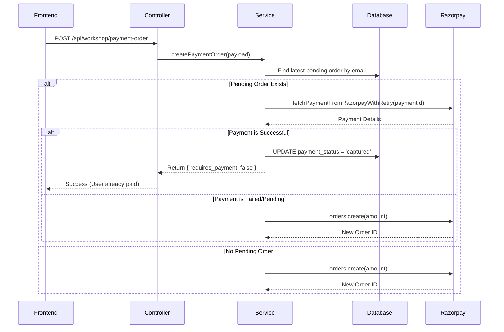
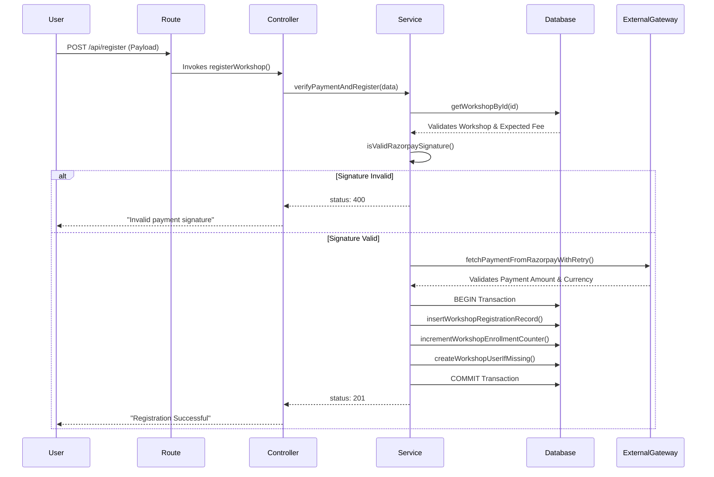

# Backend Implementation & Execution Flow Documentation

This document serves as the definitive guide to the internal execution flows, request lifecycles, service orchestration, and implementation behavior of the backend architecture. It transitions beyond high-level feature summaries to explicitly detail **how** requests move, **how** services execute, and **how** the system survives failures.

---

## Table of Contents
1. [Global Request Pipeline & System Architecture](#1-global-request-pipeline--system-architecture)
2. [Payment & Reconciliation Engine (Cross-Cutting)](#2-payment--reconciliation-engine-cross-cutting)
3. [Workshop Registration System](#3-workshop-registration-system)
4. [Mentor Registration System](#4-mentor-registration-system)
5. [Internship & Summer School Systems](#5-internship--summer-school-systems)
6. [Institutional Registration System](#6-institutional-registration-system)
7. [Support Ticket System](#7-support-ticket-system)
8. [User Dashboard & Progress Tracking](#8-user-dashboard--progress-tracking)
9. [File Upload & Storage Architecture](#9-file-upload--storage-architecture)
10. [Notification System](#10-notification-system)

---

## 1. Global Request Pipeline & System Architecture

### 1.1 System Orchestration & App Pipeline
All requests enter through `app.js`. The Express server orchestrates middleware and routing sequentially.

**Execution Flow:**
1. **CORS & Parsers:** `cors()` allows cross-origin requests. `express.json()` parses payloads and specifically attaches `req.rawBody` for webhook verification.
2. **Static Mounts:** `/uploads` is mapped via `express.static()` to serve local files directly.
3. **Route Mounting:** Domain-specific routers are attached (e.g., `app.use('/auth', authRoutes)`).
4. **Global Error Boundary:** Any unhandled exception or explicit `next(err)` triggers `errorHandler.js` at the very end of the pipeline, returning standardized JSON error responses to prevent HTML stack traces from leaking.

### 1.2 File Interaction Flow (Global)
`app.js` → Domain Route (e.g., `workshopRoutes.js`) → Middleware (`authMiddleware.js`) → Controller (`workshopController.js`) → Service (`workshopService.js`) → DB/Integrations (`db.js`, `razorpayService.js`) → Controller Formats Response.

---

## 2. Payment & Reconciliation Engine (Cross-Cutting)

### 2.1 Feature Overview
Because webhook delivery can drop, delay, or arrive out-of-order, the backend utilizes an active **Reconciliation & Polling Engine**. Instead of blindly trusting webhook receipts, the system dynamically intercepts payment attempts and proactively queries Razorpay to prevent duplicate charges.

### 2.2 Core Service Orchestration
This engine is embedded across multiple services (Workshops, Mentors, Internships, Institutional).

**Reconciliation Execution Flow (Example: `reconcilePendingWorkshopRegistration`):**
1. System queries the DB for the user's most recent `pending` or `failed` registration attempt.
2. If an open `razorpay_order_id` is found, the system invokes `resolvePaymentFromOrderContext(razorpayClient, orderId, paymentId)`.
3. **Active Fetching:** `fetchPaymentFromRazorpayWithRetry` is executed. It wraps the `razorpayClient.payments.fetch()` call in a `for` loop, retrying up to 6 times with a 1200ms delay if the API fails or returns a transient state (`created`, `pending`).
4. **Order Fallback:** If the specific `paymentId` lookup fails, it calls `resolveSuccessfulOrderPayment`, polling Razorpay for *all* payments tied to the `orderId` to hunt for a successful transaction.
5. **Retroactive Upgrade:** If a successful payment is found, the system performs an `UPDATE` on the database row, overriding the status to `captured` or `success` and updating the `transaction_id`.

### 2.3 Important Internal Methods
- `resolvePaymentFromOrderContext(client, orderId, paymentId)`: Prevents race conditions by actively querying the gateway for truth. It solves the problem of "Frontend says failed, Gateway says processing".
- `fetchPaymentFromRazorpayWithRetry(client, paymentId)`: Polling wrapper to overcome network latency or temporary 5XX from Razorpay APIs.

### 2.4 Visual Flow Diagram (Reconciliation)

---

## 3. Workshop Registration System

### 3.1 Feature Overview
Handles user enrollment into workshops, dynamically resolving pricing, checking availability, incrementing counts securely, and linking to the core payment engine.

### 3.2 Entry Point & Routing Flow
**Route File:** `workshopRoutes.js`
**Execution Flow:**
`POST /api/workshop/register`
1. Route intercepts request.
2. Middleware: *None* (Open endpoint for guest registrations).
3. `workshopRegistrationController.registerWorkshop` is invoked.

### 3.3 Controller Execution Flow
**File:** `workshopRegistrationController.js`
1. **Extraction**: Extracts data directly from `req.body`.
2. **Delegation**: Calls `workshopRegistrationService.verifyPaymentAndRegister(req.body)`.
3. **Response Formatting**: Maps the returned object to HTTP status codes (`res.status(result.status).json(result.body)`).

### 3.4 Service Execution Flow
**File:** `workshopRegistrationService.js`
1. **Data Normalization:** Extracts `workshopId`, parses fees, standardizes email casing.
2. **Validation:** Executes DB query `getWorkshopById` to ensure workshop exists and fetch its official fee.
3. **Signature Verification:** Calls `isValidRazorpaySignature` using `crypto.createHmac`. Validates `orderId + "|" + paymentId` against `RAZORPAY_KEY_SECRET`.
4. **Amount Verification:** Calls Razorpay to fetch the order and asserts that the `amount` paid exactly matches the expected workshop fee.
5. **Database Transaction Insertion:** Calls `insertWorkshopRegistrationRecord`. Due to ongoing schema migrations, it employs a sophisticated fallback sequence:
   - Tries inserting with `country` and `payment` columns.
   - Falls back to dropping `country`.
   - Falls back to legacy columns if schema updates aren't live.
6. **Enrollment Counter:** Calls `incrementWorkshopEnrollmentCounter`. Uses atomic SQL (`SET total_enrollments = COALESCE(total_enrollments, 0) + 1`) to prevent race conditions.
7. **User Auto-Provisioning:** Calls `createWorkshopUserIfMissing`. If the email isn't in the `users` table, a shadow account is generated, hashing the phone number as a temporary password.

### 3.5 Database Execution Flow
- **Reads:** `workshop_list` (check existence), `workshop_registrations` (check duplicates), `users` (check existing account).
- **Writes:** `workshop_registrations` (INSERT new), `workshop_list` (UPDATE enrollment count atomic), `users` (INSERT shadow account).
- **Integrity:** Duplicate insertions handled gracefully by intercepting `ER_DUP_ENTRY` error codes.

---

## 4. Mentor Registration System

### 4.1 Feature Overview
Allows professionals to register as mentors with dynamic pricing based on nationality (INR vs USD). Highly complex payload structure with file uploads.

### 4.2 Entry Point & Routing Flow
**Route:** `POST /api/mentor-registration/register`
**Execution Flow:**
`mentorRoutes.js` → `mentorRegistrationUpload.fields(...)` (Multer S3/Local Middleware) → `mentorRegistrationController.registerMentor()`

### 4.3 Service Execution Flow
**File:** `mentorRegistrationService.js`
1. **Transaction Initialization**: Opens a dedicated DB transaction `await connection.beginTransaction()`.
2. **Schema Reflection**: Calls `getMentorTableColumns()`, which executes a `SHOW COLUMNS` query. This allows the backend to dynamically build SQL `UPDATE`/`INSERT` statements only for fields that currently exist in the database, ensuring zero downtime during column migrations.
3. **Upsert Logic (`upsertMentorRegistration`)**:
   - Queries `findMentorByEmail`.
   - If found, checks `isCompletedPaymentStatus`. If true, rejects update.
   - If not completed, dynamically generates an `UPDATE` statement via `getMentorWritableColumns`, injecting `COALESCE` for files (resume, photo) to preserve existing uploads if none are provided.
   - If not found, generates a dynamic `INSERT`.
4. **Commit/Rollback**: Commits transaction. If any error occurs, triggers `connection.rollback()` to prevent orphaned metadata.

### 4.4 External Service Execution Flow
- **AWS S3 via Multer**: `mentorRegistrationUpload.js` parses the `multipart/form-data`, streams `resume` and `profile_photo` to AWS S3 or local disk, and attaches URLs to `req.files`.
- **Razorpay**: Currency is dynamically switched (`INR` or `USD`) depending on the `nationality` field before invoking `razorpayClient.orders.create`.

---

## 5. Internship & Summer School Systems

### 5.1 Feature Overview
Complex multi-tier registration. Internships feature dynamic pricing based on categories (General, Lateral, EWS).

### 5.2 Service Execution Flow (`internshipRegistrationService.js`)
1. **Schema Check**: Calls `ensureInternshipFeeSettingsSchema`. If the `summer_internship_fee_settings` table doesn't exist, it executes a `CREATE TABLE IF NOT EXISTS` and populates default pricing.
2. **Fee Resolution**: `getApplicableInternshipFeeRupees` computes the fee dynamically based on `is_lateral` and `category` (General vs EWS).
3. **Transaction Context**:
   - Begins DB transaction.
   - Attempts `createInternshipRegistrationRecord`.
   - **Failure Handling**: If `ER_DUP_ENTRY` occurs (user already attempted registration), it catches the error and executes an `UPDATE` to replace the old failed payment ID with the new one, *reusing* the row instead of blocking the user.
   - Commits transaction.

### 5.3 Security & Failure Handling
- **Duplicate Prevention**: Intercepts `ER_DUP_ENTRY` at the DB driver layer.
- **Dynamic Schema Defense**: Automatically adds missing columns (like `ews_lateral_fee_rupees`) via `ALTER TABLE` if they are detected as missing during startup/execution.

---

## 6. Institutional Registration System

### 6.1 Feature Overview
Allows institutions to partner, processing high-value transactions dynamically routed by country.

### 6.2 Service Execution Flow (`institutionalRegistrationService.js`)
1. **Payment Config Resolution**: Checks `country`. If India, fee is 2500 INR. Otherwise, 500 USD.
2. **Upsert Strategy (`upsertInstitutionalAttempt`)**:
   - Uses `findLatestOpenInstitutionalAttempt` mapping by `email`, `institute_name`, and `head_email`.
   - Opens DB transaction.
   - Updates the existing pending row with new Razorpay IDs, or Inserts a new one.
3. **Webhook/Callback Verification**: Validates the signature, ensures `amount` matches the resolved `paymentConfig.amount` strictly, preventing payload tampering.

---

## 7. Support Ticket System

### 7.1 Feature Overview
Internal help desk supporting categorized tickets, admin replies, attachments, and email notifications.

### 7.2 Routing & Controller Flow
Protected routes.
`GET /api/tickets/my-tickets` → `authMiddleware.verifyToken` → `ticketController.listUserTickets`
`POST /api/tickets/admin/reply/:id` → `authMiddleware.verifyToken` → `requireRole(['admin'])` → `ticketController.addTicketReplyByAdmin`

### 7.3 Service Execution Flow (`ticketService.js`)
1. **Creation**: `createTicket` validates payload lengths.
2. **Relational Lookup**: Invokes `resolveWorkshopTitle(workshopId)` securely to append context for the email template.
3. **Multi-Table Insertion**:
   - `INSERT INTO support_tickets` -> Retrieves `insertId`.
   - `INSERT INTO ticket_messages` -> Logs the initial user description as the first message payload.
4. **Asynchronous Orchestration**:
   - Calls `notificationService.sendTicketCreatedEmail` asynchronously without `await` to prevent blocking the HTTP response.
   - Uses `void` keyword to explicitly ignore the floating promise.

### 7.4 Database Execution Flow
- **Relational Aggregation**: `listUserTickets` uses complex SQL `LEFT JOIN` on `workshop_list` and `users` combined with a correlated subquery `(SELECT tm.message FROM ticket_messages tm ... LIMIT 1) AS last_message` to fetch the ticket list efficiently in a single round trip.

---

## 8. User Dashboard & Progress Tracking

### 8.1 Feature Overview
Aggregates user data, enrolled workshops, completion tracking, and automatic certificate issuance.

### 8.2 Service Execution Flow (`userDashboardService.js`)
1. **Progress Inference Engine (`clampProgress` & mapping)**:
   - Maps raw DB rows to frontend states.
   - If explicit progress exists in `user_workshop_progress`, it relies on it.
   - **Fallback Logic**: If the user has a successful payment but 0 tracked progress, the backend automatically infers `20%` progress to initialize their dashboard state logically.
2. **Resilient Query Engine (`fetchUserWorkshopRows`)**:
   - Executes `buildWorkshopRowsQuery`.
   - Implements a 4-stage fallback array trying combinations of `includePaymentColumns` and `includeAlternativeEmail`.
   - It iterates over these queries, catching `ER_BAD_FIELD_ERROR`. This ensures that even if a database migration failed halfway, the dashboard still loads.
3. **Certificate Generation**:
   - `getCertificates` filters enrolled workshops.
   - Rules: `workshop.status === 'completed'` OR `progress_percent >= 80`.
   - Dynamically constructs a `preview_url` routing through `/api/workshop-list/:id/certificate` which proxies S3/Local assets securely.

---

## 9. File Upload & Storage Architecture

### 9.1 File Interaction & Processing
Uses a dual-storage strategy managed by Middleware.

**1. Local Storage Flow (e.g., `workshopImageUpload.js`)**
- `multer.diskStorage` points to `./uploads/workshops`.
- Filters via `fileFilter` rejecting non-image MIME types.
- Passes `req.files.thumbnail[0]` to the controller which saves the relative `/uploads/...` URL.

**2. S3 Integration Flow (`s3StorageService.js`)**
- AWS S3 SDK v3 (`@aws-sdk/client-s3`) is instantiated globally as `cachedClient`.
- **Upload (`uploadInternshipPassportPhoto`)**:
  - Uses `PutObjectCommand`.
  - Generates secure S3 Keys: `internships/{internshipSlug}/{year}/{emailSlug}/passport-photo/{timestamp}-{randomHex}{extension}` preventing collisions.
- **Retrieval (`getPresignedObjectUrl`)**:
  - Uses `@aws-sdk/s3-request-presigner`.
  - Parses `s3://bucket/key` formats, invokes `GetObjectCommand`, and generates a temporary URL expiring in `300` seconds by default.

---

## 10. Notification System

### 10.1 Internal Execution & Service Orchestration
**File:** `notificationService.js`
1. **Singleton Transporter**: `getTransporter()` initializes `nodemailer` once and caches it to prevent TCP connection overhead per request.
2. **Concurrent Execution**: `sendTicketCreatedEmail` builds an array of async tasks (`mailTasks.push(...)`) mapping emails to users and system admins concurrently.
3. **Settlement**: Executes `await Promise.allSettled(mailTasks)`. This ensures that if the admin email fails, the user email still processes.
4. **Fault Tolerance**: The root `sendMail` function catches all errors explicitly `catch (err) { return { sent: false } }`, ensuring SMTP downtime never breaks critical application flows like registration or payment verification.

---

## 11. Security Execution Flow

1. **Authentication Interception**: `authMiddleware.verifyToken` intercepts protected routes, extracts `Bearer <token>`, decodes via `jwt.verify()`, and injects `req.user`.
2. **RBAC**: `roleMiddleware` intercepts admin routes, validating `req.user.role === 'admin'`. Throws `403 Forbidden` if missing.
3. **Data Integrity**: All DB services use Parameterized Queries `(?, ?, ?)` preventing SQL injection globally.
4. **Payload Trust**: The backend never trusts the frontend for `amount` or `payment status`. It dynamically re-fetches workshop costs from `workshop_list` and compares it directly with the Razorpay payload via secure HMAC-SHA256 signature verification.

---

## 12. Visual Request Lifecycle Diagram (Registration + Payment)

